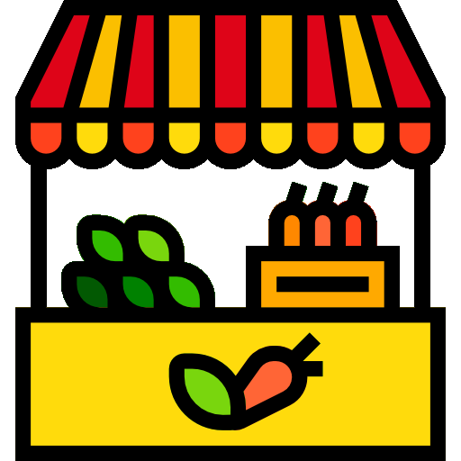
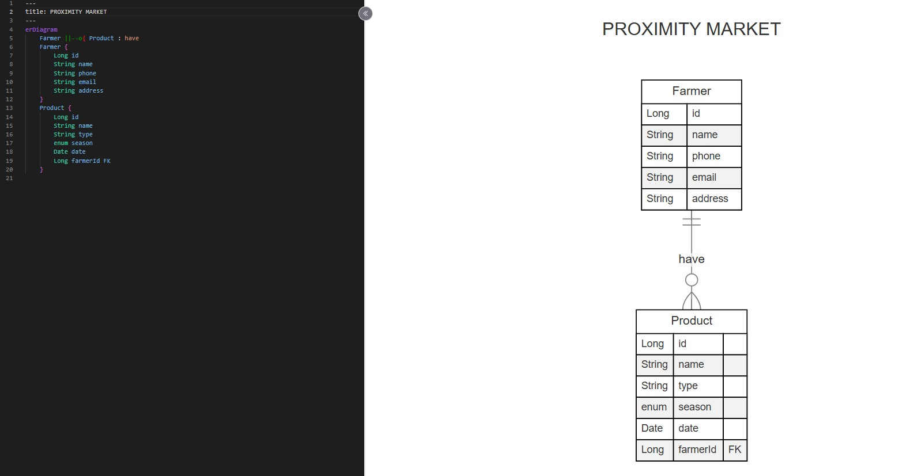
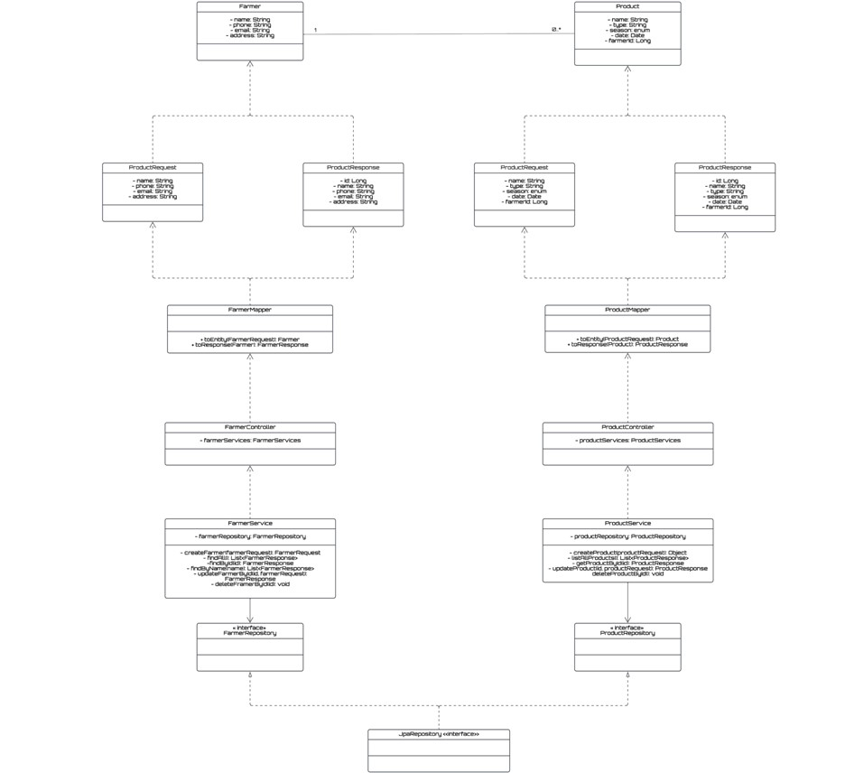
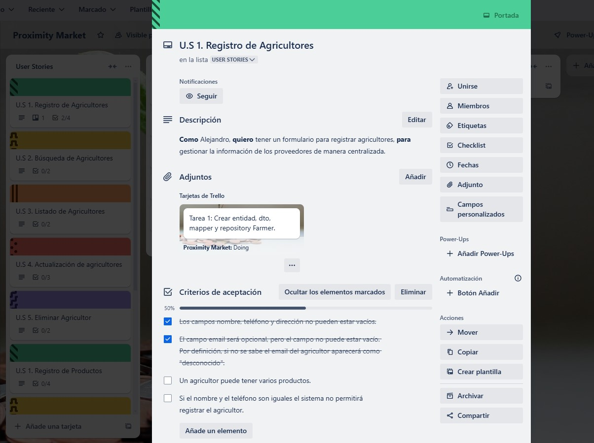

# 🛒 Proximity Market 

---

## 📝 **Introduction**
This is a Spring Boot backend application designed to manage the products grown in the Valencian garden so that they can go from the field to the table directly. We are still at the beginning of the project and at the moment the system supports the management of **Farmers** and their **Products** through CRUD operations.

---

## 🎯 **Project objectives:**

- **Farmer Management** 
  - Add, update, delete and recover farmers.
  - Validation of unique telephone numbers and proper format.

- **Product Management** 
  - Add, update, delete and recover products.
  - Associate products with farmers.

---

## 📦 **erDiagram**

---

## 📦 **UML Diagram**

---

## 📊 **Broad**

---

## 🗂️  **Files Structure**

    |--- .idea
    |--- src
        |--- main
            |--- java
                |---org.msc
                        |--- controllers
                            |--- FarmerController
                            |--- ProductController
                        |--- dtos
                            |--- FarmerRequest
                            |--- FarmerResponse
                            |--- ProductRequest
                            |--- ProductResponse
                        |--- entities
                            |--- Farmer
                            |--- Product
                        |--- exceptions
                            |--- GlobalExceptionHandler
                            |--- MarketAlreadyExistsException
                            |--- MarketExistingPhoneException
                            |--- MarketNotFoundException
                        |--- mappers
                            |--- FarmerMapper
                            |--- ProductMapper
                        |--- repositories
                            |--- FarmerRepository
                            |--- ProductRepository
                        |--- services
                            |--- FarmerService
                            |--- ProductServices
                        |--- ProximityMarketApplication
            |--- resources
                |---application.properties
        |--- test
           |--- java
               |---org.msc
                        |--- controllers
                            |--- FarmerControllerIntegrationTest

---

## UML Class Diagram

---

## 💻 Technology Stack:

 
 
  
 

 

 

 
 

---

## 🌐 Author

### **Mònica Simó**                      
    
  